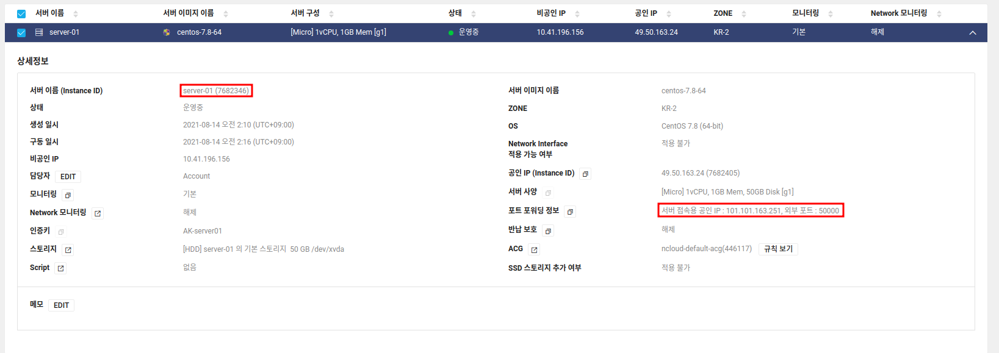
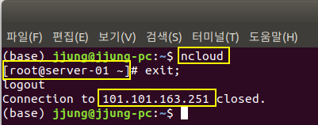
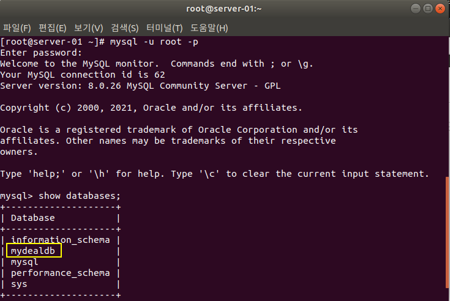
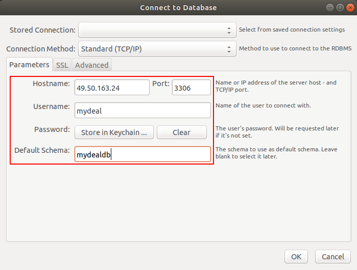
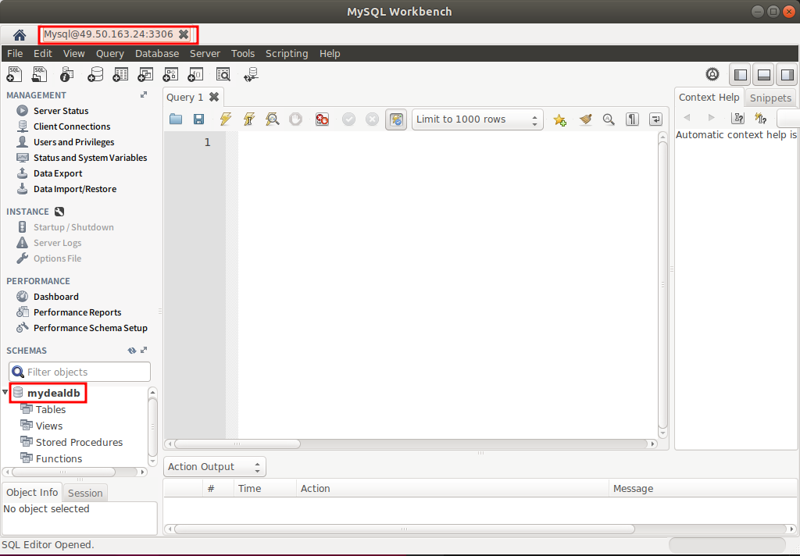
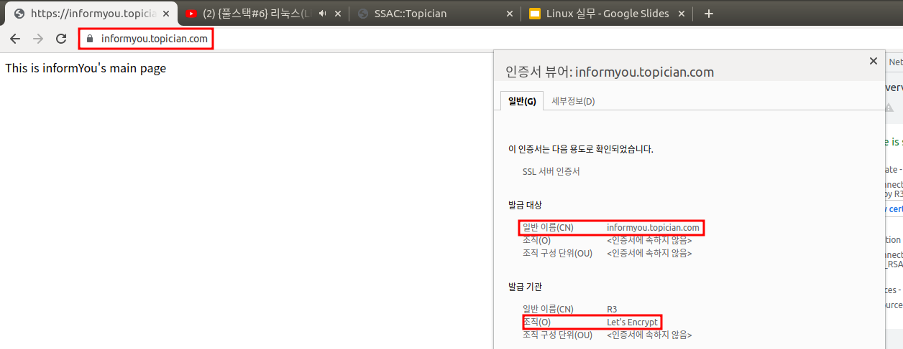

## 1. nCloud 접속 완료 화면
### - Naver Cloud Server 정보
  

### - 로컬에서 nCloud Server ssh 접속
  

## 2. MySQL workbench에서 NCP MySQL 접속
### - 터미널에서 NCP MySQL DB 리스트에서 mydeal DB 확인 
    
### - workbench에서 NCP MySQL 접속 위한 정보 입력  
    
### - workbench에서 NCP MySQL 접속 완료  
    

## 3. 브라우저에서 Https 도메인 확인
    